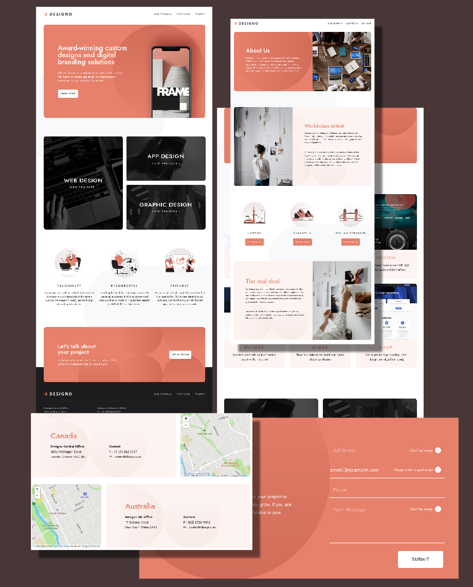

# Frontend Mentor - Designo agency website

This is a solution to the [Designo agency website challenge on Frontend Mentor](https://www.frontendmentor.io/challenges/designo-multipage-website-G48K6rfUT). Frontend Mentor challenges help you improve your coding skills by building realistic projects.

## Table of contents

- [Frontend Mentor - Designo agency website](#frontend-mentor---designo-agency-website)
  - [Table of contents](#table-of-contents)
  - [Overview](#overview)
    - [The challenge](#the-challenge)
    - [Screenshot](#screenshot)
    - [Links](#links)
  - [My process](#my-process)
    - [Built with](#built-with)
    - [What I learned](#what-i-learned)
    - [Continued development](#continued-development)
    - [Useful resources](#useful-resources)
  - [Author](#author)
  - [Acknowledgments](#acknowledgments)

## Overview

### The challenge

Users should be able to:

- View the optimal layout for each page depending on their device's screen size
- See hover states for all interactive elements throughout the site
- Receive an error message when the contact form is submitted if:
  - The `Name`, `Email Address` or `Your Message` fields are empty should show "Can't be empty"
  - The `Email Address` is not formatted correctly should show "Please use a valid email address"
- **Bonus**: View actual locations on the locations page maps (we recommend [Leaflet JS](https://leafletjs.com/) for this)

### Screenshot

### Links

- Solution URL: [Frontend Mentor](https://frontendmentor.io)
- Live Site URL: [Designo](https://)

### My process

From the [Figma](https://figma.com/) design I saw that there are 4 major sections `<body>`, `<header>`, `<cta>`, and `<footer>`, that are repeated among all the pages (with the exception of contact page). Using these sections, I wanted to create a template swapping in only the `<main>` section. Working with [React](https://reactjs.org/) would have allowed me to create reusable components to help achieve this, but since I chose to use plain HTML, much of my focus was around CSS. Making it well structured and reusable.

### Built with

- Semantic HTML5 markup
- Less CSS
- CSS Flexbox
- CSS Grid
- BEM
- [Leaflet](https://leafletjs.com/)

### What I learned

**What not to do:**

In the beginning I was using a lot of CSS built-in pattern matching rules, and while this helped keep my markup minimal, it started causing difficulties the further I went along in the project. It's also not self documenting, so if this project were to be built upon sometime in the future, that future person maintaining the project would have some difficulties understanding what is being modified and where.

Another error I made was being too concerned about a DRY approach and often grouping selectors together when they shouldn't have been. This created numerous difficulties when there was a change to the component. Often causing a ripple effect, requiring me to fix numerous elements.

**What to do:**

CSS can be a mess at times and having a naming convention like [BEM](https://en.bem.info/methodology/) along with a preprocessor like Less(https://lesscss.org/) helps keeps it structured. And since BEM is self documenting, my future self might actually be able to understand what is going on!🤞

Also by seperating concerns such as typography and position from other attributes it allowed for reusability without causing conflicts, and keeping a standard I know which selector to edit for the attribute I want to add.

example)
`... class="card__head head_level-1">`

From this, I know the parent element is `'card'`
I know it's external geometry and positioning is in the `'card__head'` selector.
I know it's font properties are in the `head_level-1` selector.
I know it's a heading element with the keyword `head`, and a level 1 with `_level-1`

**Making tasks easier:**

I like working with the command line and I discovered some very helpful tools that can speed up production and make fixes, which spread multiple files, easier to do:

Unsure where that selector is being used?

`grep -rl 'regex-pattern-of-selector'`

Need to replace/edit a word?

`grep -r 'regex-pattern' | args sed -i 's/regex-pattern/new-word/g'`

Need to extract multiple lines?

`awk '/first-line/,/last-line/' ./base.css > ./mycss.css`

### Continued development

I didn't make use of much of Less's features and that is something I want to try and use more in the future. Particulary, variables, mixins, extends. I'd also like to continue working on having a standard structure to my CSS file structure.

### Useful resources

- [BEM](https://en.bem.info/methodology/) - This helped me get a better understanding of BEM and proper naming conventions to give my CSS selectors.
- [Less](https://lesscss.org/) - I thought Less's docs where helpful in understanding Less better.
- [Scalable CSS](https://www.xfive.co/blog/itcss-scalable-maintainable-css-architecture/) - I thought this was a nice overview on creating scalable CSS.
- [Frontend Handbook](https://infinum.com/handbook/frontend) - I found this to have many useful resources for frontend developers learning to work and a standard manner. And found the "CSS file structure" especially helpful. 

## Author

- Frontend Mentor - [@kwalker3000](https://www.frontendmentor.io/profile/kwalker3000)

## Acknowledgments

I saw this great version of the [site](https://designo.vercel.app/) and it helped me with understanding the relationship between relative and absolute positioning. 
